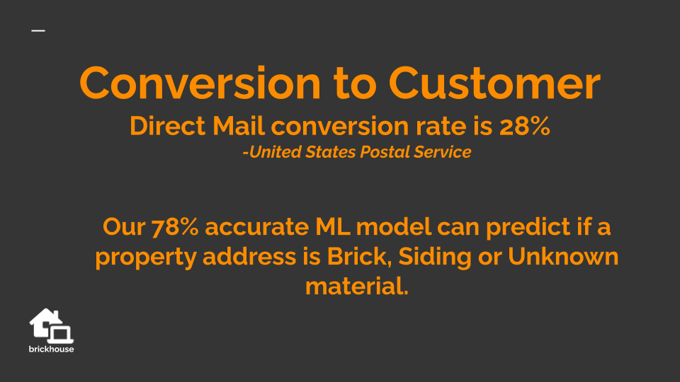
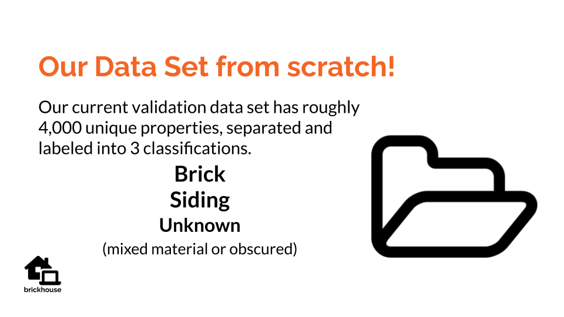
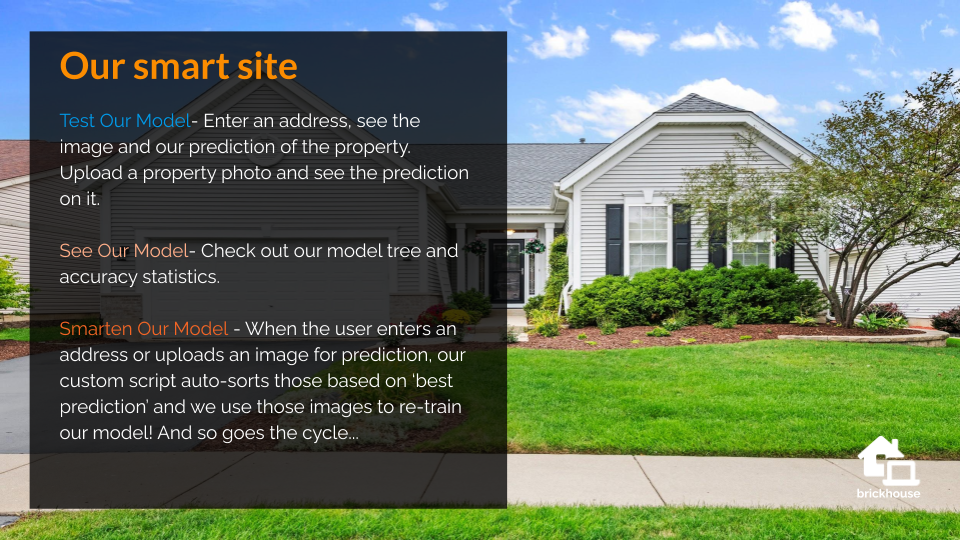
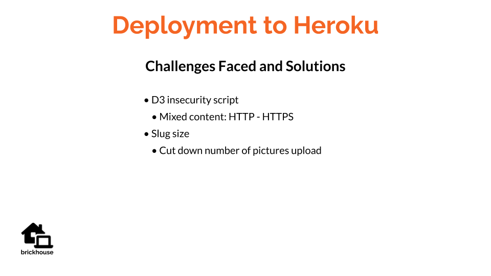

# Target Marketing Machine Learning
* python
* Flask
* keras
* tensorflow
* javascript
* HTML
* D3.js

---

[Visit our 'brickhouse' site HERE!](https://brick-house-identifier.herokuapp.com/)
---
## Visit each branch to see the corresponding team member's code and project work.

---

## Final site deployment is routed through David Fried's github repo
[deployment repo](https://github.com/david-fried/Brick-House-Identifier)
---

---
Using **Machine Learning** to cut down marketing costs for a sales or marketing campagin. Our model varifies **brick** homes or homes with siding. **Evanston, IL has a diverse mix of brick and siding homes. Evanston also had a very nice address data set. This was a great starting point for algorithm testing.** A **real estate, tuck-pointing, or painting company** can use this Machine Learning algorithm to cut down on direct marketing costs and only target brick or siding homes. This model could be tweeked for other companies such as insurance, land-scaping, or roofing.
---

---

---

---

---

---

---

---

